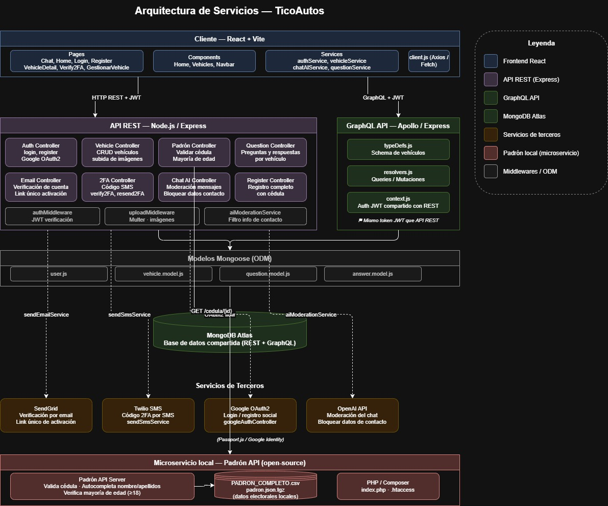

# TicoAutos Frontend

Frontend del sistema **TicoAutos**, una aplicación web para la publicación, búsqueda y gestión de vehículos en venta.  
Permite a los usuarios registrarse, iniciar sesión, explorar vehículos disponibles, ver detalles, administrar sus publicaciones y comunicarse con otros usuarios mediante un chat de preguntas y respuestas.

Este proyecto fue desarrollado con **React**, **Vite**, **React Router**, **Axios** y **Tailwind CSS**.

---

## Tecnologías utilizadas

- React
- Vite
- React Router DOM
- Axios
- Tailwind CSS
- JavaScript
- HTML5 & CSS3

---

## Estructura del proyecto

``` 
ticoautos-frontend
│
├── public
│
├── src
│   ├── assets
│   │
│   ├── components
│   │   ├── Home
│   │   │   ├── HeroSection.jsx
│   │   │   ├── Pagination.jsx
│   │   │   ├── VehicleCard.jsx
│   │   │   └── VehicleFilters.jsx
│   │   │
│   │   ├── Vehicles
│   │   │   ├── MyVehicleCard.jsx
│   │   │   └── VehicleForm.jsx
│   │   │
│   │   └── Navbar.jsx
│   │
│   ├── pages
│   │   ├── Chat.jsx
│   │   ├── GestionarVehicle.jsx
│   │   ├── Home.jsx
│   │   ├── Login.jsx
│   │   ├── PublicHome.jsx
│   │   ├── Register.jsx
│   │   └── VehicleDetail.jsx
│   │
│   ├── services
│   │   ├── authService.js
│   │   ├── questionService.js
│   │   └── vehicleService.js
│   │
│   ├── App.jsx
│   ├── main.jsx
│   ├── App.css
│   └── index.css
│
├── .gitignore
├── eslint.config.js
├── index.html
├── package.json
├── vite.config.js
└── README.md
```

---

## Instalación y ejecución

1. Clonar el repositorio
```bash
git clone https://github.com/Jimenajr05/ticoautos-frontend.git
cd ticoautos-frontend
```

2. Instalar dependencias
```bash
npm install
```

3. Ejecutar el proyecto en desarrollo
```bash
npm run dev
```

El proyecto se ejecutará normalmente en `http://localhost:5173`.

---

## Conexión con el backend

Este frontend consume el backend mediante Axios. El backend debe estar ejecutándose en `http://localhost:3000`.

* Autenticación: `http://localhost:3000/api/auth`
* Vehículos: `http://localhost:3000/api/vehicles`
* Preguntas: `http://localhost:3000/api/questions`

---

## Funcionalidades principales

1. **Autenticación**: Registro, inicio de sesión y persistencia en `sessionStorage`.
2. **Gestión de vehículos**: Crear, editar, eliminar, marcar como vendido y listar vehículos propios.
3. **Búsqueda y filtrado**: Filtros por marca, modelo, año, precio y estado, con paginación.
4. **Detalle del vehículo**: Información completa, enlace público y botón hacia el chat.
5. **Chat entre usuarios**: Preguntas, respuestas y gestión de conversaciones.

---

## Manejo de sesión

La aplicación utiliza `sessionStorage` para guardar el token y los datos de usuario, manteniendo la sesión activa mientras la pestaña permanezca abierta.

---

## Requisitos para funcionar correctamente

- Node.js y npm instalados
- Backend de TicoAutos corriendo en `http://localhost:3000`
- MongoDB funcionando desde el backend
- Navegador web moderno

---

## Autoras

- María Paz Ugalde Araya
- María Jimena Jara Rojas

# TicoAuto

